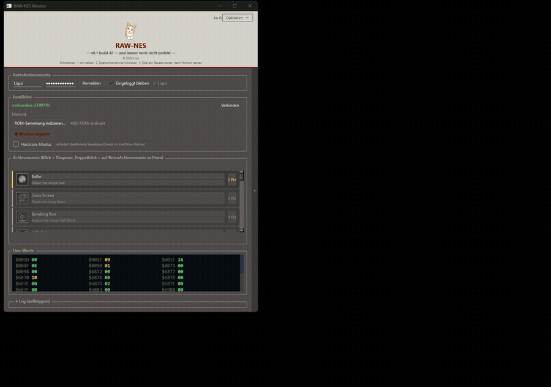

# RAW-NES

[English](README.md) | Deutsch

RetroAchievements auf einer echten NES, per USB über den EverDrive N8 PRO.
Kein Emulator im Spiel.

Ein eigener FPGA-Kern auf dem EverDrive belauscht den CPU-Bus der NES und
spiegelt den Arbeitsspeicher der Konsole in FPGA-Block-RAM. RAW-NES liest
diese Werte live über USB, wertet die RetroAchievements-Bedingungen auf dem
PC aus und schaltet Achievements frei, während du auf Originalhardware
spielst.

---

## Zwei Fassungen

| | [**C++-Port**](cpp/) | [Python-Fassung](python/) |
|---|---|---|
| Installation | keine, nur entpacken | Python erforderlich |
| Achievement-Liste mit Badges | ja | nur im Log |
| Freischalt-Popup | ja | nein |
| Leaderboard-Sidebar | ja | nur im Log |
| Live-RAM-Anzeige | ja | ja |
| Hardcore-Modus | ja | ja |
| Sprachwechsel ohne Neustart | ja | nein |

**Nimm den C++-Port.** Dort findet die Weiterentwicklung statt. Die
Python-Fassung funktioniert weiterhin und bleibt verfügbar, neue Funktionen
kommen aber in den Port.

Downloads für beide: **[Releases](https://github.com/liquid-wq/raw-nes/releases)**

---

## Voraussetzungen

* NES oder kompatible Konsole
* EverDrive N8 PRO mit USB-Kabel zum PC
* Windows 64-Bit
* Ein RetroAchievements-Konto
* Deine NES-ROM-Sammlung auf dem PC (`.nes`, `.zip`, `.7z`)

---

## Erste Schritte

Release herunterladen, entpacken und der Einrichtung in der README der
gewählten Fassung folgen: [`cpp/README.de.md`](cpp/README.de.md) oder
[`python/README.md`](python/README.md).

Kurz gefasst: FPGA-Kerne aus dem Programm heraus auf die EverDrive-SD-Karte
einrichten, bei RetroAchievements anmelden, ROM-Ordner einmalig indizieren,
Spiel auf der Konsole starten, dann den Monitor starten.

---

## Fehler melden

Ausschließlich über GitHub Issues, mit Spielname, verwendeter Fassung und dem
Log aus dem Programmfenster.

---

## Lizenz

Quelloffen einsehbar, aber nicht frei verwendbar. Siehe [`LICENSE`](LICENSE).
Fremdkomponenten und deren Lizenzen stehen in
[`THIRD-PARTY-NOTICES.txt`](THIRD-PARTY-NOTICES.txt).

Erstellt von Liqui.
